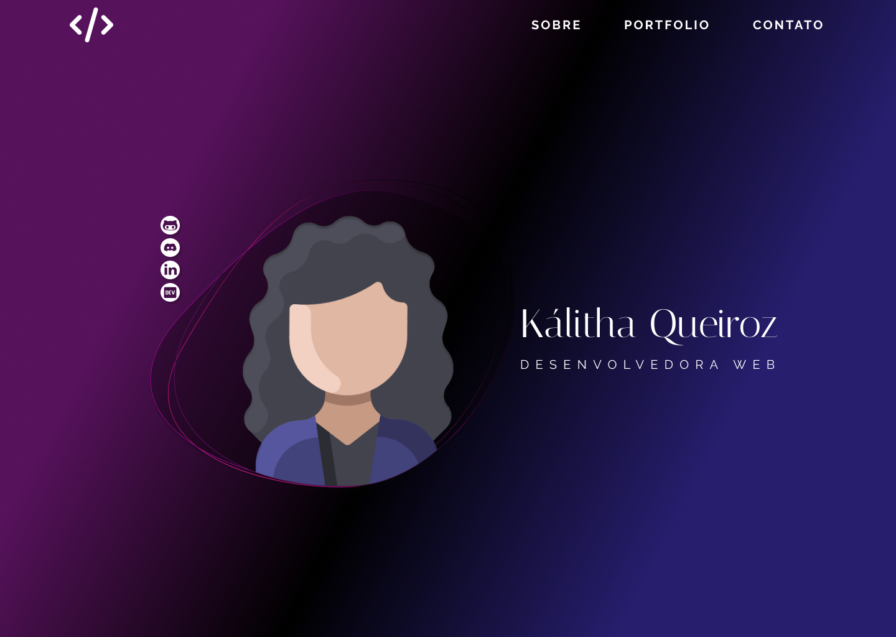
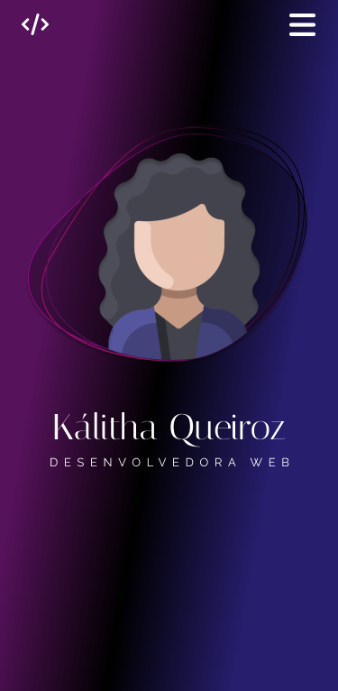
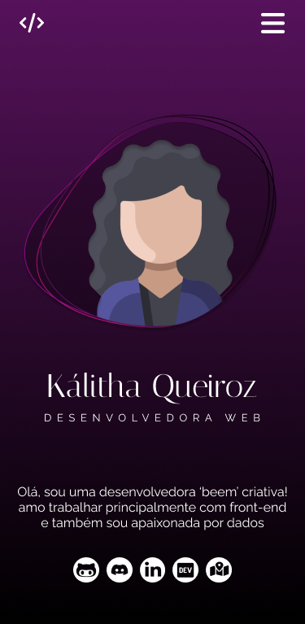
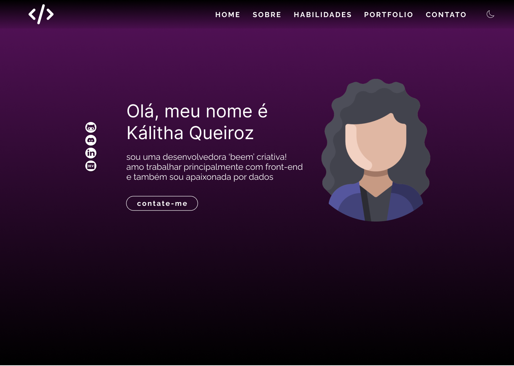

# 🎯 Portfólio

Bem-vindo ao meu portfólio! Eu sou Kálitha Queiroz.

## 📌 Sobre
### **https://github.com/kalithaQueiroz/Portfolio**
#### Este projeto será desenvolvido com o objetivo de criar uma plataforma intuitiva e responsiva para a apresentação de portfólio profissional com uso de **UI/UX Design** e uma interface inovadora e funcionail. A aplicação terá uma interface de usuário dinâmica e acessível. O design foi planejado no Figma, priorizando uma experiência de usuário fluida e moderna, focada em usabilidade e acessibilidade.
#### Este portfólio será construído com o objetivo de demonstrar habilidades em tecnologias Front-End como: **Figma**, **HTML5**, **CSS3**, **JavaScript** e  relacionadas.
#### Além disso, o projeto busca não apenas exibir as habilidades técnicas, mas também demonstrar capacidade de colaborar em um ambiente de desenvolvimento ágil, mantendo uma atenção aos detalhes visuais e de interação.

## 📚 Tecnologias

- **Angular**: Framework utilizado para construir a estrutura.
- **HTML5**: Linguagem de marcação que garante acessibilidade e semântica.
- **CSS3**: Utilizado para criar layouts modernos e responsivos.
- **JavaScript**: Responsável pela interatividade e dinâmica das páginas.
- **Figma**: Ferramenta de design usada para a prototipação e desenvolvimento da interface. 
- **UI/UX**: Usado para criar uma experiência digital agradável e satisfatória para o usuário.

## ✨ Diferenciais

#### 1. **Tema Personalizável** - O portfólio contará com um tema claro e escuro, permitindo que os usuários alterem a aparência de acordo com sua preferência de visualização.
#### 2. **Animações Suaves e Microinterações** - Uso de animações suaves e microinterações em botões e links para melhorar a usabilidade e manter o usuário engajado. Tudo isso sem comprometer o desempenho da aplicação.
#### 3. **Depoimentos e Colaborações** - Depoimentos de clientes e colaboradores com links para projetos colaborativos, oferecendo uma visão mais completa sobre minha experiência e abordagem de trabalho.
#### 4. **Desempenho e Acessibilidade** - Foco na otimização de desempenho e acessibilidade (usando Lighthouse para testes), garantindo que o site seja rápido e acessível para todos os usuários, independentemente do dispositivo.

## 🚧 Estrutura do Projeto

#### O portfólio foi organizado da seguinte maneira:

##### Back-end: ...
##### Front-end: ...
##### Banco de dados: ...

#### Coming soon ...

## 	💻 Preview
<table>
  <tr>
    <td></td>
    <td rowspan="2"></td>
    <td rowspan="2"></td>
  </tr>
  <tr>
    <td></td>
  </tr>
</table>

## 🤖 Autora
### Kálitha Queiroz

#### Caso tenha interesse em colaborar ou conversar sobre o projeto, entre em contato.
#### Agradeço por visitar meu portfólio!

:octocat:
